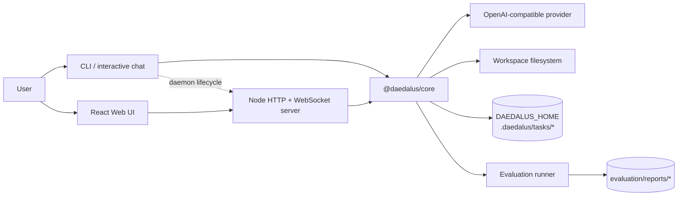

# Daedalus Architecture

This document describes the architecture implemented in `Daedalus/` as audited on 2026-10-05. It records the current system, not the final thesis freeze: Phase 10 live evaluation remains pending while the configured provider endpoint is unreachable, and Phase 11 final freeze/tag has not been performed.

## 1. Architectural principle

Daedalus is **one core with two thin interfaces**:

- `@daedalus/core` owns the agent loop, task contracts, event log, tools, execution harness, validation/recovery, modes, slash-command definitions, provider registry, attachment rules, and orchestrator.
- `cli/` renders terminal interactions, manages the local daemon lifecycle, and calls the core or server.
- `server/` is an HTTP/WebSocket gateway over the same core and workspace filesystem.
- `daedalus-web/` renders state and submits commands; it does not contain agent, tool, or LLM logic.
- `evaluation/` drives the core headlessly and derives metrics from recorded events/results.

The dependency/scope side of this rule is enforced by `scripts/check.sh`, which verifies that all interfaces depend on the same workspace `@daedalus/core` and rejects agent/tool/LLM implementation symbols in interface packages.

## 2. System diagram

## 3. Packages

### 3.1 Core (`core/`)

Important modules:

| Area | Files | Responsibility |
|---|---|---|
| Contracts | `src/contracts.ts` | `TaskSpec`, `TaskState`, final reports, typed event names, `AgentMode`, provider, attachment, and child-task types. |
| Agent | `src/agent/` | Task interpretation, planning/replanning, context assembly, provider/tool loop, observations, and stop conditions. |
| Runtime | `src/runtime.ts` | `TaskRunner`, the single facade used by CLI/server/evaluation; wires provider, tools, harness, validator, mode controller, approvals, reports, cancellation, and orchestrated runs. |
| Events/persistence | `src/events.ts`, `src/persistence.ts` | Monotonic per-task event sequencing, append-only NDJSON persistence, state snapshots, replay, and cancellation markers. |
| Tools | `src/tools/` | The 10 default tools and their model-facing JSON schemas. |
| Execution | `src/execution/` | Approval broker, policy checks, dispatch, timeouts, cancellation, concurrency and output/disk limits. |
| Validation/recovery | `src/validation/` | Build/test/lint command discovery/execution, result aggregation, error normalization, retry/replan/abort decisions. |
| Interaction | `src/interaction/` | `ModeController`, `SlashCommandRegistry`, provider registry/store, and `OrchestratorRunner`. |
| Provider | `src/providers/` | OpenAI-compatible chat/streaming adapter and typed LLM error taxonomy. |
| Design tokens | `src/palette.ts`, `src/theme.ts` | Single Crush-derived palette/theme source, including five mode accents in dark/light themes. |

### 3.2 CLI (`cli/`)

- `src/index.ts` defines `daedalus` commands: bare launcher, `health`, `run`, `serve`, `status`, `stop`, `chat`, `cancel`, and gated `ask`.
- `src/launcher.ts` owns `.daedalus/daemon.json`, health probing, one-instance background server startup/reuse, logs, browser opening, and graceful stop.
- `src/interactive.ts` renders the Crush-style terminal session: bordered input, streamed events, timeline/tool/diff output, status bar, Shift+Tab mode cycling, approval prompts, attachments, and slash commands.
- `src/tray.ts` isolates tray capability detection and menu actions behind an injectable backend.

### 3.3 Server (`server/`)

- `src/main.ts` loads settings, constructs the app context, loads providers, attaches the WebSocket channel, and starts HTTP.
- `src/app.ts` exposes settings/session/provider/model/task/workspace/upload APIs, approval/cancel endpoints, task reports/changes/attachments, and built Web UI files when `daedalus-web/dist` exists.
- `src/events.ts` bridges core task events to WebSocket replay/live streaming.
- `src/workspace.ts` implements allowed-root tree/list/file operations.
- `src/uploads.ts` parses JSON/multipart uploads and ZIP archives with file/count/byte limits and relative-path sanitization.

Principal HTTP surfaces:

- Health/session/settings: `/health`, `/session`, `/session/mode`, `/session/auto-approve`, `/settings`
- Providers/models: `/providers`, `/providers/:id/test`, `/providers/:id/enabled`, `/models`
- Tasks: `/tasks`, `/tasks/:id`, `/tasks/:id/report`, `/tasks/:id/changes`, `/tasks/:id/attachments`, `/tasks/:id/approve`, `/tasks/:id/cancel`
- Workspace/uploads: `/workspace/roots`, `/workspace/tree`, `/workspace/list`, `/workspace/file`, `/workspace/create`, `/workspace/folders`, `/workspace/files`, `/workspace/rename`, `/uploads`

### 3.4 Web (`daedalus-web/`)

React/Vite components render the workspace tree/editor/terminal surfaces, composer, mode/provider/model controls, activity timeline, approvals, diffs, validation/report panels, attachments, child tasks, and settings/providers. State/selectors derive views from server task snapshots and event streams. Shared mode and slash behaviour comes from browser-safe core subpath exports; the Web package does not re-implement the agent.

In development, Vite proxies REST and WebSocket calls to `http://127.0.0.1:3080` by default (`DAEDALUS_SERVER` can override it). In production, the Node server can serve `daedalus-web/dist` from `/` while preserving API routes and returning the SPA shell only for browser navigations.

### 3.5 Evaluation (`evaluation/`)

- `tasks/tasks.json`: 12 curated tasks (4 bug fixes, 4 feature additions, 4 refactors), fixture files, done criteria, validation commands, and deterministic scripted actions for harness validation.
- `runners/run-evaluation.ts`: generates isolated fixture workspaces, runs `TaskRunner`, and records results/events.
- `runners/aggregate.ts` and `runners/evaluation-core.ts`: derive per-run metrics, CSV/JSON datasets, aggregate metrics, failure taxonomy, comparison fields, and thesis Markdown.
- `reports/`: generated datasets. `deterministic` and `live` are distinct modes and must never be relabelled.

## 4. Task lifecycle

1. The CLI, Web/server, or evaluation runner creates a task goal with workspace, mode, provider/model, attachments, budgets, and approval policy.
2. `TaskRunner` interprets the goal into a `TaskSpec` and creates a plan.
3. The agent loop builds ordered context (role, task, repository context, plan, tool guidance, history/observations, attachment metadata, and vision content only when supported).
4. The provider returns text or tool calls. Mode policy filters which tools are even offered; fabricated or hidden tool calls are denied.
5. Mutating/executing calls pass the approval gate according to mode and session state.
6. The harness executes tools in the workspace, records outputs, truncates oversized observations, and emits file/command events.
7. Validation runs the configured/discovered build/test/lint checks. Failures feed bounded recovery/replanning; success is gated by validation evidence rather than the model's claim.
8. Stop conditions include completion, cancellation, iteration/error budgets, repeated/no-progress detection, invalid actions, and provider/tool failures.
9. A final report summarizes outcome, diff, evidence, turns/tool calls/events/commands/files/recoveries/replans, and timing/token data when available.

Every meaningful transition is an event. Event types include task/plan lifecycle, model requests, tool calls, file changes, commands, validation, recovery/replanning, approvals, mode changes, slash commands, provider changes, attachments, and child-task start/finish.

## 5. Persistence and replay

With the default `DAEDALUS_HOME=.daedalus`, each task is persisted under `.daedalus/tasks/<task_id>/` as append-only `events.jsonl` plus `state.json`. Sequence numbers are allocated by the core event authority. The CLI, Web, reports, replay tests, and evaluation metrics all derive from the same records, so the observed run and measured run are the same artifact.

Additional local state:

- `<DAEDALUS_HOME>/daemon.json`: background server PID/host/port/start time/URL.
- `<DAEDALUS_HOME>/providers.json`: provider registry persisted by the server/core store. API keys in this file are credentials; public views mask them.
- `.daedalus/daemon.log`: background server log used by launcher diagnostics.

## 6. Modes, approvals, and orchestration

The `ModeController` is the policy authority:

- `ask` and `plan`: only read tools are visible.
- `manual`: all tools are visible; mutating/executing tools ask every time.
- `auto`: all tools are visible; ordinary policy applies unless session auto-approve is enabled.
- `orchestrator`: all tools are visible under the same session policy, plus child-task decomposition.

Mode changes happen only at turn boundaries and are emitted as `MODE_CHANGED`. Entering/leaving `orchestrator` marks replanning as required. The orchestrator decomposes by done criteria or plan steps, runs children sequentially by default, links parent/child events, enforces per-child and total budgets, detects no-progress, cancels later children after total-budget failure, aggregates evidence, and validates/reports once.

## 7. Providers, attachments, and vision

The provider registry stores display name, OpenAI-compatible base URL, optional API key, models/default model, enabled flag, and vision hints. It discovers models and implements test-connection with `GET /models`. Public representations omit the raw API key and expose only a mask plus `hasApiKey`.

Attachments are workspace-confined metadata. The server enforces upload limits (20 files, 10 MiB/file, 25 MiB total; ZIP max 200 entries and 50 MiB uncompressed). Task-scoped uploads live under `.daedalus/attachments/<taskId>` by default. Image bytes are converted to OpenAI-compatible data URLs only when the selected provider/model resolves as vision-capable and size/count limits allow; otherwise the model receives attachment metadata and an explicit statement that image bytes were not sent.

## 8. Launcher and tray

Bare `daedalus` reuses a healthy daemon or starts exactly one background server, writes state atomically with restrictive permissions, then shows `1` Open CLI, `2` Open Web, and `0`/`q` leave. `serve` can run foreground or delegate to the daemon path; `status` reports URL/health/PID/tray capability; `stop` sends a graceful stop through the lifecycle module.

The tray is a capability layer, not a bundled native implementation in this build. Its menu model contains Open CLI, Open Web, Status, and Quit, and the logic is unit-tested with an injectable backend. Headless environments and desktop sessions without a backend report that no tray is available and point to `status`/`stop`. A real desktop icon and Quit click require owner/manual verification.

## 9. Design system

Core palette/theme tokens are the source of truth for CLI and Web. They include Crush/CharmTone-derived colors, typography/spacing/motion tokens, spinner glyphs, diff accents, and five mode accents in both dark and light themes. The CLI uses terminal rendering of the same tokens; the Web maps them to CSS variables/Tailwind/Monaco/xterm themes. Tests enforce palette parity and reject hardcoded interface colors in the checked surfaces.

## 10. Security boundaries actually implemented

- Tools resolve paths against the workspace root and reject lexical `..` escapes.
- Upload paths are sanitized; ZIP entries and upload sizes/counts are limited.
- `run_command` uses an executable allowlist, blocks interactive/dangerous patterns, applies timeouts/cancellation/output caps, and kills process groups.
- Provider keys are masked in public settings/provider views and should be supplied through environment or the server-side registry, not committed.
- The task workspace and allowed server roots restrict ordinary file APIs.

These are local application boundaries, not a complete OS security sandbox. See [Limitations and future work](limitations-and-future-work.md) for symlink, authentication, environment-inheritance, and deployment caveats.

## 11. Decision records

See the [ADR index](decisions/README.md). In particular:

- ADR-0001: core/interface boundary.
- ADR-0002: TypeScript/Node stack and OpenAI-compatible provider.
- ADR-0003: JSON/NDJSON event persistence.
- ADR-0004: workspace layout (its “reference clones remain read-only” wording is historical and was superseded by the owner's 2026-10-05 reuse decision in `PLAN.md` and `docs/THIRD_PARTY.md`).
- ADR-0005: 12-task evaluation scope.
- ADR-0006: product session, modes, providers, and attachments.
- ADR-0007: background server lifecycle, startup menu, and tray fallback.
